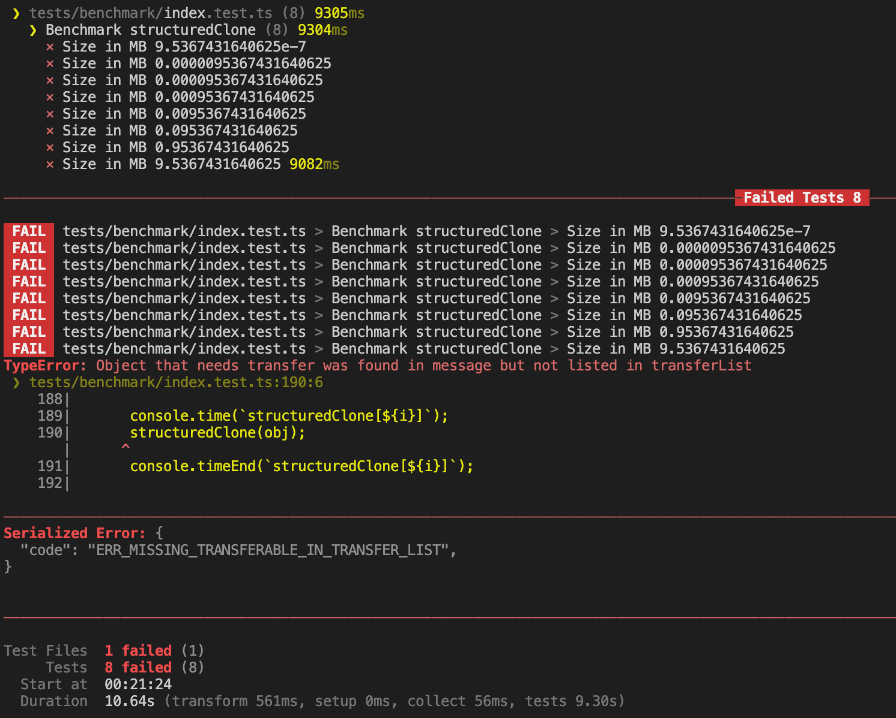

# transferables

[](https://bundlejs.com/?q=transferables&bundle "Check the total bundle size of transferables")

[NPM](https://www.npmjs.com/package/transferables) <span style="padding-inline: 1rem">|</span> [GitHub](https://github.com/okikio/transferables#readme) <span style="padding-inline: 1rem">|</span> [Licence](./LICENSE)

A utility library that lists out all [transferable objects](https://developer.mozilla.org/en-US/docs/Glossary/Transferable_objects) that can be moved between Workers and the main thread\*.

> _`*` There are many [asterisks](#asterisks) involved in transferable objects, I've listed out some of them to be aware of, but as always, do your own research before using._

<!-- > You can also read the [blog post](https://blog.okikio.dev/transferables), created for it's launch. -->

## Installation

```bash
npm install transferables
```

<details>
    <summary>Others</summary>

```bash
yarn add transferables
```

or

```bash
pnpm install transferables
```

</details>
<br>

## Usage

```ts
import { hasTransferables, getTransferables } from "transferables";
```

You can also use it directly through a script tag:

```html
<script src="https://unpkg.com/transferables" type="module"></script>
<script type="module">
  // You can then use it like this
  const { hasTransferables, getTransferables } = window.Transferables;
</script>
```

You can also use it via a CDN, e.g.

```ts
import { hasTransferables, getTransferables } from "https://cdn.skypack.dev/transferables";
// or
import { hasTransferables, getTransferables } from "https://cdn.jsdelivr.net/npm/transferables";
// or any number of other CDN's
```

<br>


## Showcase

A couple sites/projects that use `transferables`:

<!-- - [bundlejs](https://bundlejs.com) -->
- Your site/project here...
  
<br>


## API

The API of `transferables` is pretty straight forward, 
* `hasTransferables` quickly checks if the input contains at least one [transferable object](https://developer.mozilla.org/en-US/docs/Glossary/Transferable_objects).
* `getTransferable` returns an iterator that contains the [transferable objects](https://developer.mozilla.org/en-US/docs/Glossary/Transferable_objects) from the input.
* `getTransferables` generates an [transferable objects](https://developer.mozilla.org/en-US/docs/Glossary/Transferable_objects) from the input.
* `isSupported` tests what transferable objects are actually supported (support isn't always guranteed) and returns an object with features that are supported.
* `isObject`, `isTypedArray`, `isStream`, `isMessageChannel`, `isTransferable`, and `filterOutDuplicates` are utility functions that are used internally by `transferable`.

You use them like this:

```ts
import { hasTransferables, getTransferables, getTransferable } from "transferables";

// data is an object that contains transferable objects
const data = { /* ... */ }

// Quick check for transferable object
const containsTransferables = hasTransferables(data);

// Send postMessage with transferables, if they exist
const transferables = containsTransferables ? getTransferables(data) : undefined;
postMessage(data, transferables);

// Clone data with transferables, if they exist
const transferablesIterator = containsTransferables ? Array.from(getTransferable(data)) : undefined;
structuredClone(data, transferablesIterator);

// isSupported
isSupported(); // { channel: true, streams: true }

// isObject
isObject(data); // true

// isTypedArray
isTypedArray(data); // false

// isStream
isStream(data); // false

// isMessageChannel
isMessageChannel(data); // false

// isTransferable
isTransferable(data); // false

// filterOutDuplicates
filterOutDuplicates([1, 2, 3, 3, 4, 5, 5]); // [1, 2, 3, 4, 5]
```


### Advanced Usage

> Note: `(Readable/Writeable/Transform)streams` aren't transferables in all js runtimes; devs can decide based off the runtime whether to support streams or not
 
> Note: depending on how large your object is you may blow through the `maxCount` (max iteration count), if you need to change the max number of iterations remember that--that might cause the thread to be blocked while it's computing.

```ts
/**
 * Quickly checks to see if input contains at least one transferable object, up to a max number of iterations
 * Thanks @aaorris
 * 
 * @param obj Input object
 * @param streams Includes streams as transferable
 * @param maxCount Maximum number of iterations
 * @returns Whether input object contains transferable objects
 */
hasTransferables(data: unknown, streams: boolean, maxCount: number): boolean


/**
 * Creates an array of transferable objects which exist in a given input, up to a max number of iterations
 * ...
 * @returns An array of transferable objects
 */
getTransferables(data: unknown, streams: boolean, maxCount: number): TypeTransferable[]


/**
 * An iterator that contains the transferable objects from the input, up to a max number of iterations
 * ...
 * @returns Iterator that contains the transferable objects from the input
 */
getTransferable(data: unknown, streams: boolean, maxCount: number): Generator<TypeTransferable | TypeTypedArray | MessageChannel | DataView>
```

<br>

## Benchmarks
**Machine**: [GitHub Action `ubuntu-latest`](https://docs.github.com/en/actions/using-github-hosted-runners/about-github-hosted-runners#supported-runners-and-hardware-resources)
* 2-core CPU (x86_64)
* 7 GB of RAM
* 14 GB of SSD space

**JS Runtime**s:
* `Node 19` - This benchmark was run using `vitest`
* `Deno 1.28.3`
* `Bun v0.2.2` - This benchmark was run using `vitest` (it's basically a clone of the nodejs benchmark)
* `Chrome (latest)`
* `Firefox (latest)`
* `Safari (latest)`


### Node

<details>
<summary>structuredClone</summary>  


|            | hasTransferables        | structuredClone (manually)  | structuredClone (getTransferable*) | structuredClone (getTransferables) |
| ---------- | ----------------------- | --------------------------- | ---------------------------------- | ---------------------------------- |
| 1 B        | in 0.236 ms ± 0.213 ms  | in 4.872 ms ± 1.536 ms      | in 4.913 ms ± 1.989 ms             | in 4.955 ms ± 1.995 ms             |
| 2 B        | in 0.118 ms ± 0.019 ms  | in 4.56 ms ± 1.915 ms       | in 4.65 ms ± 1.766 ms              | in 4.575 ms ± 1.757 ms             |
| 4 B        | in 0.112 ms ± 0.02 ms   | in 4.071 ms ± 1.767 ms      | in 4.266 ms ± 1.485 ms             | in 4.465 ms ± 1.363 ms             |
| 8 B        | in 0.096 ms ± 0.01 ms   | in 3.661 ms ± 1.199 ms      | in 4.154 ms ± 1.653 ms             | in 5.028 ms ± 2.563 ms             |
| 16 B       | in 0.1 ms ± 0.019 ms    | in 5.457 ms ± 4.709 ms      | in 7.949 ms ± 2.636 ms             | in 4.308 ms ± 1.446 ms             |
| 32 B       | in 0.12 ms ± 0.035 ms   | in 4.37 ms ± 1.791 ms       | in 4.28 ms ± 1.518 ms              | in 3.871 ms ± 1.208 ms             |
| 64 B       | in 0.121 ms ± 0.029 ms  | in 6.079 ms ± 4.468 ms      | in 10.952 ms ± 4.055 ms            | in 3.675 ms ± 0.823 ms             |
| 128 B      | in 0.093 ms ± 0.009 ms  | in 3.75 ms ± 1.109 ms       | in 4.026 ms ± 1.142 ms             | in 4.141 ms ± 1.412 ms             |
| 256 B      | in 0.104 ms ± 0.026 ms  | in 3.898 ms ± 1.123 ms      | in 4.599 ms ± 1.304 ms             | in 6.024 ms ± 3.107 ms             |
| 512 B      | in 0.131 ms ± 0.059 ms  | in 4.501 ms ± 1.136 ms      | in 5.489 ms ± 1.163 ms             | in 5.217 ms ± 1.225 ms             |
| 1.024 kB   | in 0.132 ms ± 0.025 ms  | in 6.407 ms ± 2 ms          | in 8.602 ms ± 4.44 ms              | in 9.678 ms ± 1.826 ms             |
| 2.048 kB   | in 0.142 ms ± 0.015 ms  | in 7.446 ms ± 1.569 ms      | in 11.972 ms ± 2.425 ms            | in 13.765 ms ± 3.61 ms             |
| 4.096 kB   | in 0.152 ms ± 0.05 ms   | in 11.829 ms ± 2.282 ms     | in 18.41 ms ± 3.901 ms             | in 17.337 ms ± 3.333 ms            |
| 8.192 kB   | in 0.534 ms ± 0.689 ms  | in 22.943 ms ± 3.914 ms     | in 37.064 ms ± 6.373 ms            | in 32.482 ms ± 6.235 ms            |
| 16.384 kB  | in 0.32 ms ± 0.08 ms    | in 40.381 ms ± 8.647 ms     | in 70.484 ms ± 12.781 ms           | in 68.021 ms ± 12.511 ms           |
| 32.768 kB  | in 0.444 ms ± 0.036 ms  | in 66.95 ms ± 4.575 ms      | in 122.046 ms ± 7.226 ms           | in 117.206 ms ± 11.53 ms           |
| 65.536 kB  | in 1 second ± 0.074 ms  | in 130.533 ms ± 2.157 ms    | in 242.031 ms ± 9.481 ms           | in 222.998 ms ± 11.668 ms          |
| 131.072 kB | in 2.437 ms ± 0.952 ms  | in 257.059 ms ± 4.67 ms     | in 489.348 ms ± 28.648 ms          | in 476.162 ms ± 92.423 ms          |
| 262.144 kB | in 5.812 ms ± 1.166 ms  | in 616.424 ms ± 47.499 ms   | in 1,013.188 ms ± 76.474 ms        | in 928.491 ms ± 24.666 ms          |
| 524.288 kB | in 9.499 ms ± 1.463 ms  | in 1,224.647 ms ± 63.669 ms | in 2,111.471 ms ± 110.902 ms       | in 1,892.643 ms ± 50.748 ms        |
| 1.049 MB   | in 19.494 ms ± 1.372 ms | in 2,540.146 ms ± 44.994 ms | in 4,334.773 ms ± 147.678 ms       | in 3,934.628 ms ± 352.028 ms       |


</details>


<details>
<summary>MessageChannel</summary>  

|            | hasTransferables            | postMessage (no transfers)   | postMessage (manually)       | postMessage (getTransferable*) | postMessage (getTransferables) |
| ---------- | --------------------------- | ---------------------------- | ---------------------------- | ------------------------------ | ------------------------------ |
| 1 B        | in 0.572 ms ± 0.303 ms      | in 0.613 ms ± 0.125 ms       | in 0.724 ms ± 0.176 ms       | in 1.087 ms ± 0.361 ms         | in 0.92 ms ± 0.135 ms          |
| 2 B        | in 0.336 ms ± 0.024 ms      | in 0.494 ms ± 0.059 ms       | in 0.585 ms ± 0.069 ms       | in 0.794 ms ± 0.101 ms         | in 12.373 ms ± 23.371 ms       |
| 4 B        | in 0.292 ms ± 0.022 ms      | in 0.498 ms ± 0.082 ms       | in 0.568 ms ± 0.088 ms       | in 0.751 ms ± 0.091 ms         | in 0.854 ms ± 0.179 ms         |
| 8 B        | in 0.298 ms ± 0.025 ms      | in 0.513 ms ± 0.07 ms        | in 0.535 ms ± 0.045 ms       | in 0.781 ms ± 0.131 ms         | in 5.724 ms ± 9.664 ms         |
| 16 B       | in 0.366 ms ± 0.065 ms      | in 0.552 ms ± 0.072 ms       | in 0.542 ms ± 0.011 ms       | in 0.814 ms ± 0.134 ms         | in 0.949 ms ± 0.359 ms         |
| 32 B       | in 0.411 ms ± 0.073 ms      | in 0.612 ms ± 0.087 ms       | in 0.631 ms ± 0.028 ms       | in 1.036 ms ± 0.246 ms         | in 5.493 ms ± 9.067 ms         |
| 64 B       | in 0.486 ms ± 0.166 ms      | in 0.831 ms ± 0.164 ms       | in 0.753 ms ± 0.034 ms       | in 1.268 ms ± 0.272 ms         | in 1.116 ms ± 0.299 ms         |
| 128 B      | in 0.583 ms ± 0.065 ms      | in 1.155 ms ± 0.187 ms       | in 1.136 ms ± 0.189 ms       | in 1.739 ms ± 0.381 ms         | in 1.487 ms ± 0.342 ms         |
| 256 B      | in 0.821 ms ± 0.076 ms      | in 1.697 ms ± 0.22 ms        | in 1.622 ms ± 0.151 ms       | in 4.138 ms ± 3.54 ms          | in 2.203 ms ± 0.472 ms         |
| 512 B      | in 1.422 ms ± 0.132 ms      | in 2.84 ms ± 0.374 ms        | in 2.765 ms ± 0.354 ms       | in 4.286 ms ± 0.731 ms         | in 11.174 ms ± 13.864 ms       |
| 1.024 kB   | in 2.589 ms ± 0.355 ms      | in 5.138 ms ± 0.723 ms       | in 5.119 ms ± 0.688 ms       | in 6.843 ms ± 0.319 ms         | in 7 ms ± 1.151 ms             |
| 2.048 kB   | in 4.923 ms ± 0.847 ms      | in 9.568 ms ± 1.39 ms        | in 9.578 ms ± 1.362 ms       | in 12.955 ms ± 0.699 ms        | in 13.293 ms ± 2.112 ms        |
| 4.096 kB   | in 8.465 ms ± 0.138 ms      | in 19.355 ms ± 4.535 ms      | in 17.75 ms ± 0.917 ms       | in 31.352 ms ± 7.008 ms        | in 27.615 ms ± 5.205 ms        |
| 8.192 kB   | in 17.735 ms ± 2.094 ms     | in 35.301 ms ± 2.799 ms      | in 34.435 ms ± 1.824 ms      | in 54.482 ms ± 11.626 ms       | in 52.157 ms ± 11.877 ms       |
| 16.384 kB  | in 42.497 ms ± 5.61 ms      | in 74.145 ms ± 2.401 ms      | in 75.17 ms ± 3.51 ms        | in 110.657 ms ± 20.587 ms      | in 102.849 ms ± 21.945 ms      |
| 32.768 kB  | in 69.581 ms ± 4.887 ms     | in 142.885 ms ± 8.179 ms     | in 147.824 ms ± 9.997 ms     | in 216.289 ms ± 38.624 ms      | in 202.999 ms ± 35.166 ms      |
| 65.536 kB  | in 142.708 ms ± 13.538 ms   | in 294.519 ms ± 22.334 ms    | in 284.79 ms ± 14.444 ms     | in 443.316 ms ± 110.387 ms     | in 402.639 ms ± 66.026 ms      |
| 131.072 kB | in 275.193 ms ± 7.918 ms    | in 606.462 ms ± 26.131 ms    | in 564.778 ms ± 27.358 ms    | in 822.995 ms ± 106.78 ms      | in 812.484 ms ± 138.545 ms     |
| 262.144 kB | in 638.652 ms ± 18.611 ms   | in 1,270.838 ms ± 26.366 ms  | in 1,340.494 ms ± 37.816 ms  | in 1,771.083 ms ± 116.978 ms   | in 1,619.731 ms ± 74.565 ms    |
| 524.288 kB | in 1,313.968 ms ± 44.102 ms | in 2,518.425 ms ± 93.157 ms  | in 2,719.672 ms ± 84.072 ms  | in 3,594.096 ms ± 157.428 ms   | in 3,309.634 ms ± 103.748 ms   |
| 1.049 MB   | in 2,528.012 ms ± 61.709 ms | in 5,346.026 ms ± 190.173 ms | in 5,290.777 ms ± 296.915 ms | in 7,493.436 ms ± 537.441 ms   | in 6,659.471 ms ± 244.316 ms   |


</details>


### Deno

<details>
<summary>structuredClone</summary>


|            | hasTransferables        | structuredClone (manually)   | structuredClone (getTransferable*) | structuredClone (getTransferables) |
| ---------- | ----------------------- | ---------------------------- | ---------------------------------- | ---------------------------------- |
| 1 B        | in 0.117 ms ± 0.203 ms  | in 0.567 ms ± 0.156 ms       | in 0.76 ms ± 0.505 ms              | in 0.573 ms ± 0.262 ms             |
| 2 B        | in 0.019 ms ± 0.016 ms  | in 0.606 ms ± 0.303 ms       | in 0.582 ms ± 0.179 ms             | in 0.573 ms ± 0.219 ms             |
| 4 B        | in 0.014 ms ± 0.007 ms  | in 0.464 ms ± 0.098 ms       | in 0.548 ms ± 0.122 ms             | in 0.608 ms ± 0.269 ms             |
| 8 B        | in 0.015 ms ± 0.008 ms  | in 0.455 ms ± 0.071 ms       | in 0.569 ms ± 0.147 ms             | in 0.56 ms ± 0.144 ms              |
| 16 B       | in 0.014 ms ± 0.006 ms  | in 0.5 ms ± 0.066 ms         | in 0.882 ms ± 0.716 ms             | in 0.552 ms ± 0.11 ms              |
| 32 B       | in 0.013 ms ± 0.005 ms  | in 0.47 ms ± 0.047 ms        | in 0.665 ms ± 0.109 ms             | in 0.618 ms ± 0.109 ms             |
| 64 B       | in 0.014 ms ± 0.007 ms  | in 0.582 ms ± 0.065 ms       | in 0.815 ms ± 0.276 ms             | in 0.707 ms ± 0.14 ms              |
| 128 B      | in 0.014 ms ± 0.006 ms  | in 0.808 ms ± 0.264 ms       | in 0.996 ms ± 0.183 ms             | in 0.945 ms ± 0.236 ms             |
| 256 B      | in 0.018 ms ± 0.009 ms  | in 0.954 ms ± 0.09 ms        | in 1.396 ms ± 0.275 ms             | in 1.285 ms ± 0.277 ms             |
| 512 B      | in 0.021 ms ± 0.011 ms  | in 1.391 ms ± 0.09 ms        | in 2.084 ms ± 0.233 ms             | in 1.816 ms ± 0.12 ms              |
| 1.024 kB   | in 0.026 ms ± 0.017 ms  | in 2.238 ms ± 0.069 ms       | in 3.466 ms ± 0.063 ms             | in 3.068 ms ± 0.094 ms             |
| 2.048 kB   | in 0.04 ms ± 0.032 ms   | in 4.129 ms ± 0.096 ms       | in 6.648 ms ± 0.205 ms             | in 5.611 ms ± 0.111 ms             |
| 4.096 kB   | in 0.074 ms ± 0.077 ms  | in 8.161 ms ± 0.414 ms       | in 12.691 ms ± 0.451 ms            | in 10.8 ms ± 0.211 ms              |
| 8.192 kB   | in 0.127 ms ± 0.135 ms  | in 15.597 ms ± 1.113 ms      | in 25.163 ms ± 1.378 ms            | in 21.515 ms ± 0.84 ms             |
| 16.384 kB  | in 0.119 ms ± 0.01 ms   | in 30.545 ms ± 1.34 ms       | in 51.083 ms ± 1.751 ms            | in 42.547 ms ± 1.219 ms            |
| 32.768 kB  | in 0.249 ms ± 0.014 ms  | in 61.777 ms ± 1.967 ms      | in 106.12 ms ± 13.34 ms            | in 96.159 ms ± 19.72 ms            |
| 65.536 kB  | in 0.542 ms ± 0.01 ms   | in 132.909 ms ± 7.829 ms     | in 219.194 ms ± 5.547 ms           | in 172.7 ms ± 5.948 ms             |
| 131.072 kB | in 1.371 ms ± 0.158 ms  | in 251.366 ms ± 9.552 ms     | in 408.53 ms ± 6.089 ms            | in 371.217 ms ± 19.852 ms          |
| 262.144 kB | in 3.258 ms ± 0.714 ms  | in 517.315 ms ± 26.088 ms    | in 829.651 ms ± 36.92 ms           | in 718.925 ms ± 39.184 ms          |
| 524.288 kB | in 5.296 ms ± 1.395 ms  | in 1,081.495 ms ± 62.784 ms  | in 1,635.766 ms ± 50.949 ms        | in 1,464.703 ms ± 80.873 ms        |
| 1.049 MB   | in 10.125 ms ± 0.878 ms | in 2,205.881 ms ± 153.917 ms | in 3,511.416 ms ± 49.166 ms        | in 3,113.454 ms ± 88.31 ms         |


</details>


<details>
<summary>MessageChannel</summary>  


</details>


<details>
<summary>Worker</summary>

|            | hasTransferables             | postMessage (no transfers)   | postMessage (manually)       | postMessage (getTransferable*) | postMessage (getTransferables) |
| ---------- | ---------------------------- | ---------------------------- | ---------------------------- | ------------------------------ | ------------------------------ |
| 1 B        | in 5.274 ms ± 1.535 ms       | in 1.477 ms ± 0.176 ms       | in 2.144 ms ± 0.459 ms       | in 2.522 ms ± 0.279 ms         | in 2.109 ms ± 0.116 ms         |
| 2 B        | in 1.02 ms ± 0.257 ms        | in 0.829 ms ± 0.05 ms        | in 1.184 ms ± 0.166 ms       | in 1.641 ms ± 0.288 ms         | in 1.226 ms ± 0.074 ms         |
| 4 B        | in 1.029 ms ± 0.237 ms       | in 0.767 ms ± 0.056 ms       | in 1.055 ms ± 0.102 ms       | in 1.422 ms ± 0.129 ms         | in 1.141 ms ± 0.057 ms         |
| 8 B        | in 1.069 ms ± 0.266 ms       | in 0.75 ms ± 0.101 ms        | in 1.223 ms ± 0.119 ms       | in 1.234 ms ± 0.047 ms         | in 1.151 ms ± 0.051 ms         |
| 16 B       | in 1.098 ms ± 0.305 ms       | in 0.801 ms ± 0.119 ms       | in 1.087 ms ± 0.061 ms       | in 1.348 ms ± 0.051 ms         | in 1.204 ms ± 0.089 ms         |
| 32 B       | in 1.013 ms ± 0.235 ms       | in 0.893 ms ± 0.155 ms       | in 1.064 ms ± 0.066 ms       | in 1.685 ms ± 0.204 ms         | in 1.325 ms ± 0.14 ms          |
| 64 B       | in 1.19 ms ± 0.257 ms        | in 1.167 ms ± 0.248 ms       | in 1.181 ms ± 0.065 ms       | in 1.925 ms ± 0.209 ms         | in 1.605 ms ± 0.162 ms         |
| 128 B      | in 1.543 ms ± 0.331 ms       | in 1.38 ms ± 0.119 ms        | in 1.459 ms ± 0.076 ms       | in 2.33 ms ± 0.221 ms          | in 2.052 ms ± 0.301 ms         |
| 256 B      | in 2.16 ms ± 0.39 ms         | in 1.889 ms ± 0.279 ms       | in 2.036 ms ± 0.167 ms       | in 3.045 ms ± 0.255 ms         | in 2.811 ms ± 0.459 ms         |
| 512 B      | in 3.414 ms ± 0.677 ms       | in 2.968 ms ± 0.328 ms       | in 3.084 ms ± 0.219 ms       | in 4.97 ms ± 0.975 ms          | in 4.425 ms ± 0.284 ms         |
| 1.024 kB   | in 5.781 ms ± 1.047 ms       | in 5.615 ms ± 0.601 ms       | in 5.195 ms ± 0.511 ms       | in 6.621 ms ± 0.897 ms         | in 5.898 ms ± 0.095 ms         |
| 2.048 kB   | in 10.808 ms ± 2.161 ms      | in 9.578 ms ± 1.14 ms        | in 9.556 ms ± 1.458 ms       | in 12.216 ms ± 1.797 ms        | in 10.658 ms ± 0.304 ms        |
| 4.096 kB   | in 20.634 ms ± 4.081 ms      | in 19.337 ms ± 2.288 ms      | in 16.972 ms ± 1.144 ms      | in 23.834 ms ± 3.846 ms        | in 20.588 ms ± 0.743 ms        |
| 8.192 kB   | in 37.522 ms ± 0.851 ms      | in 33.76 ms ± 2.378 ms       | in 33.458 ms ± 1.807 ms      | in 46.509 ms ± 5.087 ms        | in 39.052 ms ± 0.375 ms        |
| 16.384 kB  | in 71.85 ms ± 3.632 ms       | in 73.338 ms ± 7.561 ms      | in 64.387 ms ± 0.791 ms      | in 104.53 ms ± 10.474 ms       | in 84.133 ms ± 6.901 ms        |
| 32.768 kB  | in 194.305 ms ± 22.236 ms    | in 199.264 ms ± 38.017 ms    | in 182.548 ms ± 32.041 ms    | in 208.273 ms ± 14.496 ms      | in 197.019 ms ± 6.808 ms       |
| 65.536 kB  | in 301.619 ms ± 17.916 ms    | in 266.598 ms ± 11.198 ms    | in 296.565 ms ± 38.027 ms    | in 383.53 ms ± 51.396 ms       | in 317.135 ms ± 14.129 ms      |
| 131.072 kB | in 576.109 ms ± 28.564 ms    | in 558.362 ms ± 30.514 ms    | in 569.61 ms ± 87.563 ms     | in 698.831 ms ± 20.12 ms       | in 639.793 ms ± 10.721 ms      |
| 262.144 kB | in 1,250.771 ms ± 168.716 ms | in 1,092.555 ms ± 26.022 ms  | in 1,084.701 ms ± 45.234 ms  | in 1,412.306 ms ± 49.827 ms    | in 1,274.971 ms ± 26.051 ms    |
| 524.288 kB | in 2,367.449 ms ± 155.411 ms | in 2,277.334 ms ± 58.657 ms  | in 2,329.497 ms ± 106.941 ms | in 2,885.096 ms ± 63.014 ms    | in 2,721.838 ms ± 106.331 ms   |
| 1.049 MB   | in 4,571.345 ms ± 172.758 ms | in 4,695.677 ms ± 410.801 ms | in 4,640.202 ms ± 239.044 ms | in 5,865.573 ms ± 126.505 ms   | in 5,604.887 ms ± 178.402 ms   |


</details>


### Bun

<details>
<summary>structuredClone</summary>


|            | hasTransferables        | structuredClone (manually)   | structuredClone (getTransferable*) | structuredClone (getTransferables) |
| ---------- | ----------------------- | ---------------------------- | ---------------------------------- | ---------------------------------- |
| 1 B        | in 0.247 ms ± 0.267 ms  | in 4.81 ms ± 1.552 ms        | in 4.361 ms ± 0.903 ms             | in 4.129 ms ± 1 second             |
| 2 B        | in 0.113 ms ± 0.027 ms  | in 4.386 ms ± 0.656 ms       | in 4.622 ms ± 0.78 ms              | in 4.539 ms ± 0.898 ms             |
| 4 B        | in 0.138 ms ± 0.053 ms  | in 3.975 ms ± 0.576 ms       | in 4.406 ms ± 0.806 ms             | in 4.17 ms ± 0.597 ms              |
| 8 B        | in 0.117 ms ± 0.021 ms  | in 3.857 ms ± 0.468 ms       | in 4.435 ms ± 0.364 ms             | in 3.811 ms ± 0.685 ms             |
| 16 B       | in 0.109 ms ± 0.025 ms  | in 5.101 ms ± 2.231 ms       | in 8.656 ms ± 4.429 ms             | in 4.234 ms ± 0.803 ms             |
| 32 B       | in 0.137 ms ± 0.047 ms  | in 3.79 ms ± 0.743 ms        | in 3.871 ms ± 0.924 ms             | in 4.352 ms ± 1.372 ms             |
| 64 B       | in 0.155 ms ± 0.064 ms  | in 4.359 ms ± 1.196 ms       | in 12.969 ms ± 1.109 ms            | in 3.82 ms ± 0.719 ms              |
| 128 B      | in 0.134 ms ± 0.05 ms   | in 3.943 ms ± 1.071 ms       | in 4.053 ms ± 0.623 ms             | in 3.828 ms ± 0.915 ms             |
| 256 B      | in 0.11 ms ± 0.023 ms   | in 4.143 ms ± 1.131 ms       | in 4.858 ms ± 1.005 ms             | in 5.995 ms ± 3 ms                 |
| 512 B      | in 0.165 ms ± 0.057 ms  | in 4.573 ms ± 0.734 ms       | in 5.444 ms ± 0.936 ms             | in 4.81 ms ± 0.731 ms              |
| 1.024 kB   | in 0.15 ms ± 0.056 ms   | in 5.298 ms ± 0.767 ms       | in 12.423 ms ± 9.028 ms            | in 9.919 ms ± 3.493 ms             |
| 2.048 kB   | in 0.156 ms ± 0.038 ms  | in 7.542 ms ± 1.011 ms       | in 12.023 ms ± 1.621 ms            | in 13.864 ms ± 3.541 ms            |
| 4.096 kB   | in 0.163 ms ± 0.055 ms  | in 11.992 ms ± 1.509 ms      | in 19.377 ms ± 3.229 ms            | in 17.548 ms ± 3.065 ms            |
| 8.192 kB   | in 0.35 ms ± 0.338 ms   | in 22.408 ms ± 3.375 ms      | in 34.624 ms ± 4.846 ms            | in 30.67 ms ± 4.167 ms             |
| 16.384 kB  | in 0.314 ms ± 0.065 ms  | in 37.692 ms ± 7.142 ms      | in 65.858 ms ± 8.854 ms            | in 65.82 ms ± 8.31 ms              |
| 32.768 kB  | in 0.546 ms ± 0.113 ms  | in 69.807 ms ± 9.323 ms      | in 130.956 ms ± 20.049 ms          | in 117.669 ms ± 19.146 ms          |
| 65.536 kB  | in 1.035 ms ± 0.1 ms    | in 140.251 ms ± 15.45 ms     | in 261.96 ms ± 36.225 ms           | in 230.37 ms ± 33.779 ms           |
| 131.072 kB | in 2.642 ms ± 1.013 ms  | in 273.821 ms ± 27.837 ms    | in 505.793 ms ± 75.587 ms          | in 459.113 ms ± 73.966 ms          |
| 262.144 kB | in 8.046 ms ± 2.189 ms  | in 661.745 ms ± 85.731 ms    | in 1,086.604 ms ± 142.219 ms       | in 942.594 ms ± 135.851 ms         |
| 524.288 kB | in 9.755 ms ± 1.251 ms  | in 1,308.609 ms ± 144.738 ms | in 2,249.668 ms ± 396.958 ms       | in 2,034.777 ms ± 360.333 ms       |
| 1.049 MB   | in 26.499 ms ± 9.497 ms | in 2,504.882 ms ± 219.223 ms | in 4,499.338 ms ± 451.951 ms       | in 3,806.749 ms ± 301.764 ms       |


</details>


<details>
<summary>MessageChannel</summary>  


</details>


### Chrome


<details>
<summary>structuredClone</summary>


</details>


<details>
<summary>MessageChannel</summary>


</details>


<details>
<summary>Worker</summary>


</details>


### Firefox


<details>
<summary>structuredClone</summary>


</details>


<details>
<summary>MessageChannel</summary>


</details>


<details>
<summary>Worker</summary>


</details>


### Safari


<details>
<summary>structuredClone</summary>


</details>


<details>
<summary>MessageChannel</summary>


</details>


<details>
<summary>Worker</summary>


</details>


<br>

## Asterisks\*

There are a lot of asterisks involved with transferable objects. 
* First, not all transferable objects are supported in all browsers.
* Second, not all transferable objects can be transfered between Workers and the main thread.
* Third, `structuredClone` when trying to clone an object that is transferable will crashes if the transferable objects aren't listed in the transfer list.
* Fourth, and most important only use this library when you don't know the shape of the object to be transfered, as traversing the input object adds a delay.

There is quite a bit of browser compatibility issues with Transferable Objects that are just not yet resolved as far as I can tell a large number of them occur on Safari, due to either a lack of usage or just not wanting to add the feature. 

This is a list of the issues that I have found so far.

* Safari does not support transferable objects with [`TransformStream`](https://developer.mozilla.org/en-US/docs/Web/API/TransformStream#browser_compatibility), [`ReadableStream`](https://developer.mozilla.org/en-US/docs/Web/API/ReadableStream#browser_compatibility), and [`WritableStream`](https://developer.mozilla.org/en-US/docs/Web/API/WritableStream#browser_compatibility)
* [`AudioData`](https://developer.mozilla.org/en-US/docs/Web/API/AudioData) & [`VideoFrame`](https://developer.mozilla.org/en-US/docs/Web/API/VideoFrame) are not supported on Firefox and Safari
* `OffscreenCanvas` is not supported on Safari
* In a twist of fate **only** Safari supports [`RTCDataChannel`](https://developer.mozilla.org/en-US/docs/Web/API/RTCDataChannel) being transferable

So, as always, do your own research before using.

There are a couple asterisks involved in transferable objects, and it's important to note that not all transferable objects are supported in every browser.

Streams and message channel support is iffy here is a list of current support, as of Dec. 4, 2022.

Chrome 107.0.1418.62
Firefox 107.0.1
Safari 16.4

Node v19.2.0
Bun 0.2.2
Deno 1.28.3

|                           | Chrome | Firefox | Safari | Node   | Deno   | Bun    | 
| ------------------------- | ------ | ------- | ------ | ------ | ------ | ------ | 
| structuredClone (channel) | false  | false   | false  | true   | true   | true   |   
| structuredClone (streams) | true   | true    | false  | true   | false  | true   | 
| postMessage (channel)     | false  | false   | false  | -      | true   | -      |   
| postMessage (streams)     | false  | false   | false  | -      | false  | -      |   


### Transferable objects

The following are [transferable objects](https://developer.mozilla.org/en-US/docs/Glossary/Transferable_objects):

- `ArrayBuffer`
- `MessagePort`
- `ImageBitmap`
- `ReadableStream`
- `WritableStream`
- `TransformStream`
- `DataView`
- `AudioData`
- `ImageBitmap`
- `VideoFrame`
- `OffscreenCanvas`
- `RTCDataChannel`

From the brief research I've done on the topic, I've found that 

- **`ArrayBuffer`**: Can be transferred between Workers and the main thread. It's the only type of data buffer that can be transferred. 
- **`TypedArray`**: A data view of an `ArrayBuffer` (e.g. `Uint8Array`, `Int32Array`, `Float64Array`, etc.). They ***can't*** directly be transferred between Workers and the main thread, but the `ArrayBuffer` they contain can. Due to this fact, it's possible if you can have multiple `TypedArray`'s that all share the same `ArrayBuffer` only that `ArrayBuffer` is transfered. 
- **`MessagePort`**: A port to communicate with other workers. Can be transferred between Workers and the main thread. With little to now problems and good support across the board except for node which doesn't support `MessagePort` 
- **`ImageBitmap`** (`^`): An image that can be transferred between Workers and the main thread. It represents a bitmap image which can be drawn to a `<canvas>` without undue latency. It can also be used as textures in WebGL.
- **`OffscreenCanvas`**: A canvas that can be transferred between Workers and the main thread. It can also be used as a texture in WebGL.
- **`(Readable/Writable/Transform)Stream`**: A stream that can be transferred between Workers and the main thread. They can also be used to create `Response` objects. Support across js runtimes is very spotty


> _`^` unverified/untested - Make sure to do your own research for this specific use case._
> _`~` spotty support - Check below for js runtimes where it's ok to use_

> 

<br>


## Limitations

There are a couple limitations to using transferable objects with Workers and the main thread:

- Not all [transferable objects](https://developer.mozilla.org/en-US/docs/Glossary/Transferable_objects) can be transfered between Workers and the main thread. For example, `ReadableStream` and `WritableStream` can only be transfered within a Worker or a Service Worker.

- Not all [transferable objects](https://developer.mozilla.org/en-US/docs


## FAQ & Glossary

### What are transferable objects?

Transferable objects are objects that can be transferred between Workers and the main thread. It works sort of like ploping out the piece of memory attached to the Worker for the transferable object (e.g. an ArrayBuffer) and then moving that piece of memory to the main-thread for use by a newly created transferable object and vice-versa. You can read more about them in the [MDN docs](https://developer.mozilla.org/en-US/docs/Glossary/Transferable_objects).

> Notable exceptions to the transferable objects list are `Blob` and `File` objects, which are not transferable, but can be cloned.

<br />


### Why should I use this?

It's main use case is for determining when there is a transferable object and then listing said transferable objects out. A good example of when to use this is when working with [`structuredClone`](https://developer.mozilla.org/en-US/docs/Web/API/structuredClone). `structuredClone` errors out when using transferables objects as they are not cloneable, e.g. 




You should only really use this when Worker or main thread no longer needs the transferable object for use. e.g. returning the result of a complex from a Worker in ArrayBuffer form (assuming that the result is no longer nesscary in the Worker). 
> Warning: There is a performance threshold for transferable objects, before which using transferable objects becomes genuinly slower, it's probably not worth it to use this library if you reach that threshold [#benchmark](#benchmark). You can read more about that in the [MDN docs](https://developer.mozilla.org/en-US/docs/Web/API/Worker/postMessage#performance_considerations). 

<br />

### What is the difference between transferable objects and cloneable objects?

Transferable objects are objects that can be transferred between Workers and the main thread. They can be transferred from the main thread to a Worker, and vice versa. Cloneable objects are objects that can be cloned between Workers and the main thread. They can
be cloned from the main thread to a Worker, and vice versa. You can read more about them in the [MDN docs](https://developer.mozilla.org/en-US/docs/Web/API/Web_Workers_API/Structured_clone_algorithm).


<br />


## Browser Support

| Chrome | Edge | Firefox | Safari |
| ------ | ---- | ------- | ------ |
| 7+     | 12+  | 41+     | 5+     |

Native support for `transferables` is dependent on which [transferable object](https://developer.mozilla.org/en-US/docs/Glossary/Transferable_objects) great as it doesn't use any browser specific or nodejs specific API's, you should be good to use `transferables` in any environment.


## Contributing

I encourage you to use [pnpm](https://pnpm.io/configuring) to contribute to this repo, but you can also use [yarn](https://classic.yarnpkg.com/lang/en/) or [npm](https://npmjs.com) if you prefer.

Install all necessary packages

```bash
npm install
```

Then run tests

```bash
npm test
```

Build project

```bash
npm run build
```

> _**Note**: this project uses [Conventional Commits](https://www.conventionalcommits.org/en/v1.0.0/) standard for commits, so, please format your commits using the rules it sets out._

## Licence

See the [LICENSE](./LICENSE) file for license rights and limitations (MIT).
